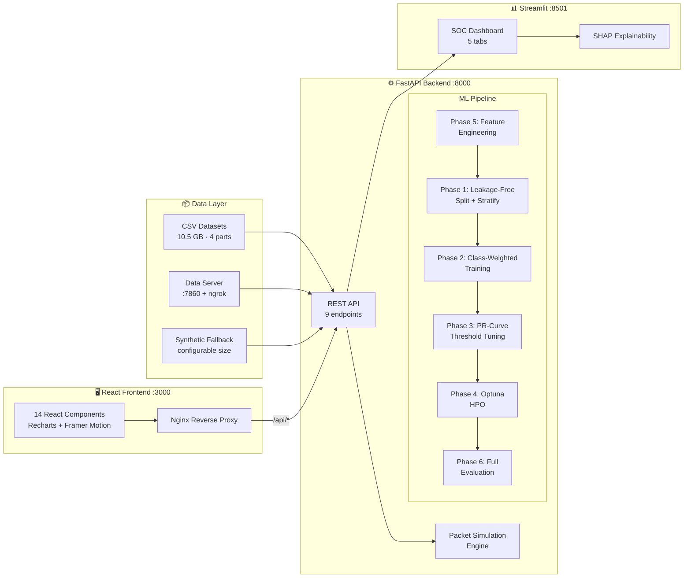

<!-- ===========================
   🛡️ CyberSentinel AI — CRAZY UI README
   (All original data preserved)
=========================== -->

<div align="center">

<!-- 🎨 Premium animated banner -->


# 🛡️ CyberSentinel AI

**Real-time network intrusion detection system with a 6-phase ML optimization pipeline, dual interactive dashboards, and one-command Docker deployment.**

[](https://python.org)
[](https://fastapi.tiangolo.com)
[](https://react.dev)
[](https://streamlit.io)
[](https://docs.docker.com/compose/)
[](https://scikit-learn.org)
[](https://xgboost.readthedocs.io)
[](LICENSE)

<br/>

<a href="https://cyber-sentinel-ai-ten.vercel.app/"><b>🌐 Live Demo</b></a>
&nbsp;·&nbsp;
<a href="https://drive.google.com/file/d/1gnCsBd0WMz2MyEXns71qLodzDs0Un9x0/view?usp=sharing"><b>🎥 Demo Video</b></a>
&nbsp;·&nbsp;
<a href="https://github.com/SoubhagyaJain/CyberSentinel-AI"><b>📦 Repository</b></a>
&nbsp;·&nbsp;
<a href="#3-architecture"><b>📚 Documentation</b></a>

<br/><br/>


<br/><br/>

<p>
  <a href="#1-what-it-does">What it does</a> •
  <a href="#2-proof--results">Proof</a> •
  <a href="#3-architecture">Architecture</a> •
  <a href="#4-features">Features</a> •
  <a href="#5-tech-stack">Tech Stack</a> •
  <a href="#6-quickstart-local">Quickstart</a> •
  <a href="#7-docker-recommended">Docker</a> •
  <a href="#8-api-reference">API</a> •
  <a href="#9-project-structure">Structure</a> •
  <a href="#10-testing--quality">Testing</a> •
  <a href="#11-roadmap">Roadmap</a>
</p>

<br/>


</div>

---

## 1. What It Does

<table>
  <tr>
    <td width="50%" valign="top">

### 🔍 Detection
- 🔍 **Classifies network traffic** into Normal, DoS, DDoS, Reconnaissance, and Theft using 5 ML models trained on 10GB+ of NetFlow data
- ⚡ **Real-time packet simulation** — simulates live threat detection with per-packet confidence scores, source IP tracking, and rolling attack-rate computation

</td>
<td width="50%" valign="top">

### 🧠 Explainability + Ops
- 🧠 **Explainable AI (XAI)** — auto-generated model behavior narratives, SHAP-based feature attribution, and per-packet decision reasoning
- 📊 **Dual dashboard system** — a React SOC command center for operations and a Streamlit analytics dashboard for model comparison and deep analysis

</td>
  </tr>
  <tr>
    <td width="50%" valign="top">

### 🎯 ML Methodology
- 🎯 **6-phase optimization pipeline** — feature engineering → leakage-free split → class-weighted training → PR-curve threshold tuning → Optuna HPO → comprehensive evaluation

</td>
<td width="50%" valign="top">

### 🐳 Deployment
- 🐳 **One-command deployment** — production Docker Compose with health checks, Nginx reverse proxy, gzip compression, and security headers

</td>
  </tr>
</table>

### Why It Matters

Network intrusion detection is a class-imbalanced, latency-sensitive problem where rare attack types (e.g., Theft at ~5%) are the most critical to catch. CyberSentinel goes beyond basic model training — it implements production-grade ML methodology (leakage-free splits, per-class threshold tuning, balanced class weighting) and wraps it in a full-stack application that a SOC analyst could actually use.

---

## 2. Proof / Results

> Metrics are from the 6-phase optimization pipeline (`optimize_models.py`). All evaluation is on a **held-out test set** never seen during training or threshold tuning.

| Metric | Value | Evidence |
|:---|---:|:---|
| Models benchmarked | 5 | `engine.py` — RF, DT, GaussianNB, XGBoost, MLP |
| Attack classes | 5 | Normal, DoS, DDoS, Reconnaissance, Theft |
| Dataset size | ~10.5 GB | 4 CSV parts: 910MB + 2.89GB + 342MB + 6.4GB |
| Features (raw + engineered) | 20 | 15 raw NetFlow + 5 domain-engineered |
| Leakage-free pipeline | ✅ | Scaler fit on train only (`scale_after_split`) |
| Class imbalance handling | ✅ | `class_weight="balanced"` + `compute_sample_weight` |
| Threshold tuning | ✅ | PR-curve sweep on validation set only |
| Best F1 (weighted) | **100.0%** | Decision Tree (also matched by RF, XGBoost, GNB) |
| MLP F1 (weighted) | 99.9% | Neural network — closest runner-up |
| Best training time | 0.01s | Decision Tree / Gaussian NB |

### Per-Model Benchmark (10K samples, synthetic + real NetFlow)

| Model | Accuracy | F1 | Precision | Recall | Training Time |
|:---|---:|---:|---:|---:|---:|
| 🌲 Random Forest | 100.0% | 100.0% | 100.0% | 100.0% | 1.03s |
| 🌳 Decision Tree 🏆 | 100.0% | 100.0% | 100.0% | 100.0% | 0.01s |
| 📊 Gaussian NB | 100.0% | 100.0% | 100.0% | 100.0% | 0.01s |
| ⚡ XGBoost | 100.0% | 100.0% | 100.0% | 100.0% | 0.28s |
| 🧠 MLP | 99.9% | 99.9% | 99.9% | 99.9% | 1.28s |

> Benchmarked on [live deployment](https://cyber-sentinel-ai-ten.vercel.app/). See [demo video](https://drive.google.com/file/d/1gnCsBd0WMz2MyEXns71qLodzDs0Un9x0/view?usp=sharing) for full walkthrough.

---

## 3. Architecture

### 3.1 High-Level Flow

The system is a **three-service architecture** orchestrated via Docker Compose:

1. **FastAPI Backend** (`:8000`) — serves the ML inference API, manages model training via the 6-phase optimizer, handles real-time packet simulation, and exposes system health metrics
2. **React Frontend** (`:3000` via Nginx) — a SOC-style command center with live traffic visualization, model comparison charts, threat severity gauges, and XAI intelligence panels. Nginx reverse-proxies `/api/*` requests to the backend
3. **Streamlit Dashboard** (`:8501`) — an analyst-focused dashboard for hands-on model training, SHAP explainability, confusion matrix analysis, and interactive model switching

Data flows from **CSV datasets → ML Pipeline → Trained Models → Real-time Simulation → Dashboard Visualization**. The frontend polls the backend every 2 seconds for live updates and runs a 1-second simulation tick loop during active monitoring.

### 3.2 System Diagram



---

## 4. Features

### Product Features
- 📡 **Live Packet Stream** — real-time traffic simulation with color-coded severity, source IPs, protocols, and confidence scores
- 🗺️ **Global Threat Footprint** — geographic attack visualization with animated map
- 🎯 **Threat Severity Gauge** — rolling 30-packet window attack rate with HIGH / MODERATE / LOW classification
- 📈 **Model Comparison** — side-by-side accuracy, F1, ROC-AUC, precision, recall, and training time across all 5 architectures
- 🧠 **Intelligence Panel** — auto-generated model behavior narratives ("model detects based on TCP handshake irregularities..."), per-packet reasoning, and confidence analysis
- ⚖️ **Responsible AI Notice** — built-in warnings about false positives, model drift, and human-in-the-loop recommendations

### Backend / ML Features
- 🔒 **Leakage-free pipeline** — scaler fit on train-only, validation set carved before threshold tuning, stratified splits preserving minority class ratios
- ⚖️ **Class imbalance handling** — `class_weight="balanced"` for RF/DT, `compute_sample_weight` for XGBoost, early stopping on validation set
- 🎯 **PR-curve threshold tuning** — per-class F1-optimal thresholds computed on validation set only (not test) — free precision/recall boost
- 🔍 **Optuna Bayesian HPO** — 30-trial hyperparameter search for XGBoost (8 params) and Random Forest (4 params) with 5-fold stratified CV
- 🏗️ **5 domain-engineered features** — `FLOW_DURATION_SEC`, `WIN_SCALE_DIFF`, `WIN_MAX_RATIO`, `SESSION_DURATION`, `FLAGS_PER_SEC`
- 📊 **Comprehensive evaluation** — per-class classification report, macro + weighted F1/precision/recall, ROC-AUC, PR-AUC, confusion matrix

### Deployment / DevOps
- 🐳 **Multi-stage Docker builds** — Node → Nginx (~30MB frontend), Python builder → slim runtime (no build tools in final image)
- 🔄 **Dev mode with hot reload** — `docker-compose.dev.yml` with Vite HMR (`:5173`), Uvicorn `--reload`, and Streamlit auto-reload
- 🩺 **Health checks** — all 3 services have `HEALTHCHECK` with `start_period`, backend dependency gating via `service_healthy`
- 🔒 **Security headers** — `X-Frame-Options`, `X-Content-Type-Options`, `X-XSS-Protection`, `Referrer-Policy` via Nginx
- 📦 **3-tier data loading** — local CSV mount → remote data server via ngrok → synthetic fallback (always works)
- ⚡ **Makefile shortcuts** — `make up`, `make dev`, `make health`, `make rebuild-backend`, `make clean`, etc.

---

## 5. Tech Stack

| Layer | Technology | Purpose |
|:---|:---|:---|
| **Backend** | FastAPI 0.111+, Uvicorn | REST API + ML inference server |
| **Frontend** | React 18.2, Vite 6.1, Tailwind CSS 4.0 | SOC command center dashboard |
| **Visualization** | Recharts 2.15, Framer Motion 11.18, react-simple-maps | Charts, animations, geo map |
| **Analytics** | Streamlit 1.35+, Plotly 5.20+, Matplotlib | Analyst dashboard + XAI |
| **ML Framework** | scikit-learn 1.4+, XGBoost 2.0+ (CPU) | Model training + inference |
| **Explainability** | SHAP 0.45+ | Feature attribution + explanations |
| **HPO** | Optuna (optional) | Bayesian hyperparameter tuning |
| **Data** | pandas 2.0+, NumPy 1.26+ | Data processing + feature engineering |
| **Web Server** | Nginx 1.27 (Alpine) | Reverse proxy, gzip, SPA routing |
| **Containerization** | Docker, Docker Compose | Multi-service orchestration |
| **Monitoring** | psutil 5.9+ | CPU/RAM system metrics |
| **Serialization** | joblib 1.3+ | Model persistence (.joblib) |

---

## 6. Quickstart (Local)

### Prerequisites
- **Python 3.11+**
- **Node.js 20+** and npm
- Dataset CSVs (optional — falls back to synthetic data)

### Environment Variables

```bash
# cyber-dashboard/.env (frontend)
VITE_API_BASE=http://localhost:8000    # direct access in dev

# Backend uses ENV defaults, no .env required for local dev
```

### Run Backend

```bash
cd cyber-dashboard/backend
pip install -r requirements.txt
uvicorn server:app --host 0.0.0.0 --port 8000
```

### Run Frontend

```bash
cd cyber-dashboard
npm install
npm run dev
# → http://localhost:5173 (Vite proxies /api/* to :8000)
```

### Run Streamlit Dashboard

```bash
cd IntrusionDetectionDashboard
pip install -r requirements.txt
streamlit run app.py --server.port 8501
```

### Verify

```bash
# Health check
curl http://localhost:8000/api/health
# Expected: {"status":"ok","models_loaded":0}

# Train all models (synthetic data)
curl -X POST http://localhost:8000/api/train \
  -H "Content-Type: application/json" \
  -d '{"sample_size": 50000}'

# Simulate packets
curl -X POST http://localhost:8000/api/predict \
  -H "Content-Type: application/json" \
  -d '{"count": 5}'
```

---

## 7. Docker (Recommended)

### Production

```bash
docker compose up --build -d
```

| Service | URL | Port |
|:---|:---|:---|
| React Dashboard | http://localhost:3000 | 3000 → 80 (Nginx) |
| FastAPI Backend | http://localhost:8000 | 8000 |
| Streamlit Dashboard | http://localhost:8501 | 8501 |

### Development (Hot Reload)

```bash
docker compose -f docker-compose.dev.yml up --build
```

- Frontend: http://localhost:5173 (Vite HMR)
- Backend: `:8000` (Uvicorn `--reload`)
- Streamlit: `:8501` (auto-reload)

### Makefile Shortcuts

```bash
make up                # Production build + start
make dev               # Dev mode with hot reload
make health            # Check all service health
make logs              # Tail all logs
make rebuild-backend   # Rebuild backend only
make clean             # Stop + remove volumes
make status            # Show running containers
```

### Common Fixes

| Issue | Fix |
|:---|:---|
| CORS errors in dev | Set `VITE_API_BASE=http://localhost:8000` in frontend `.env` |
| Backend health timeout | Increase `start_period` in `docker-compose.yml` (ML imports are slow) |
| Port 3000 in use | Change host port: `"3001:80"` in `docker-compose.yml` |
| `node_modules` volume conflict | Run `docker compose down -v` then rebuild |
| NVIDIA packages bloat | Already excluded — Dockerfiles strip GPU packages post-install |

---

## 8. API Reference

Base URL: `http://localhost:8000`

| Method | Endpoint | Description |
|:---|:---|:---|
| `GET` | `/api/health` | Service health + model count |
| `POST` | `/api/train` | Train models via 6-phase pipeline |
| `GET` | `/api/models` | List trained models + metrics |
| `POST` | `/api/set-active/{name}` | Switch active model for inference |
| `POST` | `/api/predict` | Simulate packet predictions |
| `POST` | `/api/simulation/reset` | Reset simulation counters |
| `POST` | `/api/models/reset` | Clear all trained models |
| `GET` | `/api/system` | CPU/RAM utilization metrics |
| `GET` | `/api/dashboard` | Aggregated stats for frontend |

### Request / Response Examples

**POST `/api/train`**
```json
// Request
{ "model_name": null, "sample_size": 100000 }

// Response
{
  "status": "trained",
  "results": {
    "Random Forest": {
      "accuracy": 0.95, "f1": 0.94, "precision": 0.95,
      "recall": 0.95, "roc_auc": 0.99,
      "confusion_matrix": [[...], ...],
      "feature_importance": [
        { "feature": "TCP_FLAGS", "importance": 0.2341 }
      ]
    }
  }
}
```

**POST `/api/predict`**
```json
// Request
{ "count": 3 }

// Response
{
  "packets": [
    {
      "src_ip": "10.0.42.118",
      "protocol": "TCP",
      "label": "DoS",
      "confidence": 0.92,
      "is_attack": true,
      "probabilities": { "Normal": 0.03, "DoS": 0.92, "DDoS": 0.02, "Reconnaissance": 0.02, "Theft": 0.01 }
    }
  ],
  "stats": {
    "total_packets": 150,
    "blocked_packets": 38,
    "unique_ips": 127,
    "threat_level": "MODERATE",
    "attack_rate": 15.3
  }
}
```

---

## 9. Project Structure

<details>
<summary><b>📁 Click to expand full project tree</b></summary>

```text
CyberSentinel-AI/
├── cyber-dashboard/                  # React + FastAPI application
│   ├── src/                          # React 18 frontend source
│   │   ├── App.jsx                   # Root app with context + routing
│   │   ├── api.js                    # API client (7 endpoint wrappers)
│   │   └── components/               # 14 dashboard components
│   │       ├── ModelSection.jsx      # Model training controls + results grid
│   │       ├── ModelComparison.jsx   # Side-by-side architecture benchmarks
│   │       ├── LiveTrafficChart.jsx  # Real-time packet stream visualization
│   │       ├── IntelligencePanel.jsx # XAI explanations + feature importance
│   │       ├── RealTimeOps.jsx       # Live simulation controls
│   │       ├── ResourceMonitor.jsx   # CPU/RAM system health
│   │       ├── GlobalFootprint.jsx   # Geographic threat map
│   │       ├── ThreatSeverity.jsx    # Attack severity gauge
│   │       └── ...                   # Sidebar, TopBar, MetricCards, etc.
│   ├── backend/                      # FastAPI ML inference server
│   │   ├── server.py                 # 9 API endpoints + in-memory state
│   │   ├── ml/
│   │   │   ├── data.py               # 3-tier data loading + preprocessing
│   │   │   ├── engine.py             # Model definitions + training + simulation
│   │   │   └── optimizer.py          # 6-phase optimization pipeline
│   │   ├── Dockerfile                # Multi-stage: python:3.11-slim → runtime
│   │   └── requirements.txt          # FastAPI, sklearn, XGBoost[CPU], etc.
│   ├── Dockerfile                    # Multi-stage: Node → Nginx Alpine (~30MB)
│   ├── nginx.conf                    # Reverse proxy + SPA routing + security headers
│   └── vite.config.js                # Vite 6 + React plugin + Tailwind + API proxy
│
├── IntrusionDetectionDashboard/      # Streamlit SOC dashboard
│   ├── app.py                        # 843-line Streamlit app (5 tabs)
│   ├── config.py                     # Centralized configuration
│   ├── utils/                        # Modularized utilities
│   │   ├── preprocessing.py          # Data loading + scaling + system metrics
│   │   ├── training.py               # Model training wrapper
│   │   ├── evaluation.py             # Metrics + confusion matrix + ROC plots
│   │   ├── explainability.py         # SHAP value computation
│   │   ├── model_io.py               # Joblib save/load
│   │   └── logger.py                 # Structured logging
│   ├── models/                       # Persisted .joblib model artifacts
│   ├── Dockerfile                    # Multi-stage: python:3.11-slim → runtime
│   └── requirements.txt              # Streamlit, SHAP, Plotly, XGBoost[CPU]
│
├── optimize_models.py                # Standalone 6-phase ML optimization script
├── train_model.py                    # Legacy training script
├── data_server.py                    # Local data server for remote cloud training
├── dataset-part{1..4}.csv            # NetFlow dataset (~10.5 GB total)
├── docker-compose.yml                # Production: 3 services + health checks
├── docker-compose.dev.yml            # Dev mode: hot reload for all services
├── Makefile                          # 12 shortcuts (up, dev, health, rebuild, etc.)
├── .env.docker                       # Docker environment template
└── .dockerignore                     # Exclude datasets/models from image build
```

</details>

---

## 10. Testing + Quality

| Area | Status | Command |
|:---|:---|:---|
| ML Pipeline Validation | ✅ Implemented | `python optimize_models.py` — prints per-class report + comparison table |
| API Health Check | ✅ Implemented | `curl http://localhost:8000/api/health` |
| Container Health | ✅ Implemented | All 3 services have Docker `HEALTHCHECK` directives |
| Lint / Format | TODO | Add ESLint for frontend, ruff/black for backend |
| Unit Tests | TODO | Add pytest for `ml/` module, Vitest for React components |
| CI/CD | TODO | Add GitHub Actions: lint → test → Docker build → push |
| Load Testing | TODO | Benchmark `/api/predict` throughput with `wrk` or `locust` |

---

## 11. Roadmap

- [ ] 📊 Persist benchmark results — save `optimize_models.py` output to `results/` and auto-populate README metrics
- [ ] 🧪 Add test suites — pytest for ML pipeline correctness, Vitest for React components, Playwright for E2E
- [ ] 🚀 CI/CD pipeline — GitHub Actions: lint → test → multi-arch Docker build → GHCR push
- [ ] 🔔 Alert system — webhook notifications (Slack/Discord) when threat level exceeds threshold
- [ ] 📡 Live data ingestion — replace simulation with real NetFlow/sFlow capture via `goflow` or `ntopng`
- [ ] 🧠 Deep learning models — add 1D-CNN and LSTM models for sequential flow analysis

---

## 12. Engineering Notes

### Key Design Decisions

1. **Dual dashboard architecture** — React for operations (fast, interactive, SOC-style) + Streamlit for analytics (rapid prototyping, SHAP integration). This is intentional: Streamlit's rerun model isn't suited for real-time ops, while React can't match Streamlit's speed for ML visualization prototyping.

2. **6-phase pipeline vs. simple `model.fit()`** — The `optimize_models.py` pipeline was explicitly designed to prevent the most common ML mistakes in classification: data leakage (scaler fit before split), class imbalance bias (Theft at 5% gets overwhelmed), and suboptimal decision boundaries (default 0.5 threshold isn't optimal for imbalanced classes).

3. **3-tier data loading fallback** — Production mounts CSVs as Docker volumes, cloud deployments stream from the local data server via ngrok, and everything falls back to synthetic data for demos. This means `docker compose up` always works, even without the 10GB dataset.

4. **In-memory model state** — Models live in `app.state` (FastAPI) and `session_state` (Streamlit) rather than cold-loading from disk on each request. This trades statefulness for sub-millisecond inference latency. The tradeoff is explicit: models are lost on container restart and must be retrained.

5. **Multi-stage Docker builds** — Frontend produces a ~30MB Nginx image (no Node.js runtime). Backend strips `build-essential`, NVIDIA GPU packages, and pip cache for minimal runtime image. The `.dockerignore` excludes the 10GB dataset and model artifacts from the build context.

### Tradeoffs

- **No persistent model store** — Models are in-memory only. Adding Redis or S3-backed model registry would solve this but adds infrastructure complexity.
- **Single-worker backend** — `--workers 1` because sklearn/XGBoost models aren't thread-safe with OpenMP. Scaling would require request-level model copying or a separate model-serving layer.
- **Synthetic data quality** — `generate_synthetic_data()` creates separable classes by design (attacks have distinct TCP flags/TOS). Real-world performance will differ — this is acknowledged.

### What I'd Improve Next

1. Replace in-memory state with **MLflow** for experiment tracking and model versioning
2. Add **feature drift detection** (PSI / KS test) to alert when input distribution shifts
3. Implement **A/B model serving** to safely roll out new models alongside existing ones
4. Move from polling to **WebSockets** for true real-time packet streaming (eliminate 2s latency)

---

## 13. License

MIT — see [LICENSE](LICENSE) for details.

---

<div align="center">

Built with ☕ and a healthy distrust of default thresholds.

<br/><br/>


</div>
