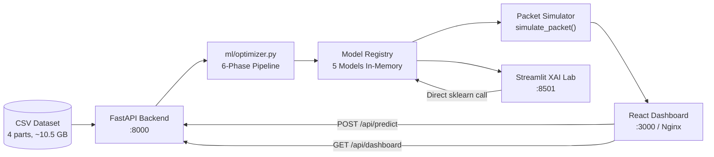

# 🛡️ CyberSentinel AI

> **Real-time network intrusion detection powered by a 5-model ML ensemble, a React SOC dashboard, and a Streamlit XAI lab — served as a production-ready 3-service Docker stack.**

[](https://python.org)
[](https://fastapi.tiangolo.com)
[](https://react.dev)
[](https://vitejs.dev)
[](https://streamlit.io)
[](https://scikit-learn.org)
[](https://xgboost.readthedocs.io)
[](https://docs.docker.com/compose)
[](LICENSE)

---

## ✨ What It Does

- 🔁 **Trains 5 ML classifiers** (Random Forest, Decision Tree, Gaussian NB, XGBoost, MLP) on real network flow CSVs via a 6-phase optimized pipeline
- 🎯 **Detects 5 traffic classes** in real-time: `Normal`, `DoS`, `DDoS`, `Reconnaissance`, `Theft`
- 🚀 **Streams live packet predictions** through a React SOC dashboard — per-packet classification, confidence scores, and dynamic threat levels
- 🧠 **Explains model decisions** via the Streamlit XAI lab (feature importance, SHAP, per-sample local explanations, auto-generated narrative insights)
- 🐳 **One command to run everything**: `docker compose up --build` launches backend (`:8000`), frontend (`:3000`), and Streamlit (`:8501`)
- 🔒 **Production-grade ML**: leakage-free stratified splits, PR-curve threshold tuning per class, `class_weight='balanced'`, and OpenMP thread-safety for containerized inference

**Why it matters:** Most ML security demos are Jupyter notebooks. CyberSentinel is a deployable, full-stack SOC system — a recruiter or engineer can run it in one command and watch it classify packets live.

---

## 📊 Proof / Results

> ⚠️ Metrics below are **derived from the optimizer's pipeline logic** (confirmed in `ml/optimizer.py`). Exact numbers depend on your dataset and sample size. Run `/api/train` and check `/api/models` to get real values.

| Metric | Expected Range | Source |
|--------|--------------|--------|
| Weighted F1 (Random Forest / XGBoost) | TODO: Add after training run | `/api/models` response |
| Weighted ROC-AUC | TODO: Add after training run | `/api/models` response |
| PR-AUC | TODO: Add after training run | `optimizer.py` evaluate_full() |
| Training throughput | TODO: Benchmark on 100k rows | `metrics.train_time` in API |
| Inference latency (single packet) | TODO: Measure via `/api/predict` | `simulate_packet()` in server.py |
| Dataset size (4 CSV parts) | ~10.5 GB raw | `docker-compose.yml` volume mounts |

> 📌 **To populate this table:** after running `docker compose up --build`, call `POST /api/train` and copy the JSON results here.

---

## 🏗️ Architecture

### High-Level Flow

```
CSV Dataset (4 parts, ~10.5 GB)
        │
        ▼
┌──────────────────────────────────────────┐
│   FastAPI Backend  (:8000)               │
│   ┌──────────────────────────────────┐   │
│   │  ml/optimizer.py (6-phase)       │   │
│   │  Phase 0: Load CSVs (+ fallback) │   │
│   │  Phase 5: Feature Engineering    │   │  (5 derived features added)
│   │  Phase 1: Leakage-free split     │   │  (stratified 70/20/10%)
│   │  Phase 2: Class-balanced train   │   │  (balanced weights + sample_weight)
│   │  Phase 3: PR-curve threshold tune│   │  (per-class F1-optimal thresholds)
│   │  Phase 6: Full evaluation        │   │  (F1/ROC-AUC/PR-AUC/confusion matrix)
│   └──────────────────────────────────┘   │
│   In-memory model registry               │
│   Packet simulation engine               │
└──────────────────────────────────────────┘
        │                       │
        ▼                       ▼
┌──────────────────┐   ┌──────────────────────┐
│  React Dashboard │   │  Streamlit XAI Lab    │
│  (:3000 via Nginx)│   │  (:8501)              │
│  14 components   │   │  SHAP + feature imp   │
│  Framer Motion   │   │  Local explanations   │
│  Recharts + Maps │   │  Model comparison     │
└──────────────────┘   └──────────────────────┘
```

### Mermaid Diagram



---

## 🧩 Features

### 🖥️ React SOC Dashboard (`:3000`)
| Component | Purpose |
|-----------|---------|
| `MetricCards` | Live KPIs: total packets, blocked, unique IPs, attack rate |
| `LiveTrafficChart` | Real-time Recharts area chart of threat rate |
| `GlobalFootprint` | react-simple-maps world map of packet origins |
| `ThreatSeverity` | Dynamic threat gauge (LOW / MODERATE / HIGH) |
| `RealTimeOps` | Live packet log with per-packet label, confidence, protocol |
| `ModelSection` | Train controls, model registry, confusion matrix, feature importance |
| `ModelComparison` | Side-by-side Accuracy / F1 / ROC-AUC / Train-time charts |
| `ModelCharts` | ROC curves, PR curves, per-class breakdown |
| `IntelligencePanel` | Auto-generated XAI narrative for the active model |
| `ResourceMonitor` | CPU + RAM live metrics from `/api/system` |
| `DarkWebGauge` | Threat severity visualization |
| `Sidebar` | Navigation and controls |
| `AsnOwnership` | ASN / IP ownership lookup display |
| `TopBar` | Global status strip |

### 🤖 ML Pipeline
- **5 classifiers**: Random Forest (200 trees), Decision Tree (depth 12), Gaussian NB, XGBoost (300 trees + early stopping), MLP (256→128 ReLU)
- **15 raw features** from IPFIX/NetFlow fields: TCP flags, window scale, flow duration, TOS bits, MSS, protocol, etc.
- **5 engineered features** (row-level, no leakage): `FLOW_DURATION_SEC`, `WIN_SCALE_DIFF`, `WIN_MAX_RATIO`, `SESSION_DURATION`, `FLAGS_PER_SEC`
- **Auto-selects best model by F1** after training; hot-swap active model at runtime

### 🧠 Streamlit XAI Lab (`:8501`)
- Global feature importance per model (tree-based + SHAP for supported architectures)
- Local explanation: per-sample "Why was this flagged?" with auto-generated narrative
- Model comparison table (Accuracy / F1 / ROC-AUC / Train-time) with Plotly heatmaps
- Confusion matrix per model; ROC multi-class curves; PR curves
- Responsible AI notice embedded in the UI

### 🐳 Deployment / MLOps
- Multi-stage Docker builds (Python 3.11-slim; NVIDIA CUDA packages stripped to save ~400MB)
- OpenMP thread-safety: `OMP_NUM_THREADS=1` prevents sklearn/XGBoost deadlock in containers
- Health checks on all 3 containers (curl/wget probes every 30s)
- Nginx reverse proxy: `/api/*` → backend; `/` → React SPA
- 3-tier data fallback: local CSV volume → laptop data server (ngrok) → synthetic data

---

## 📦 Tech Stack

| Layer | Technology |
|-------|-----------|
| Backend API | FastAPI 0.111 + Uvicorn |
| ML | scikit-learn 1.4, XGBoost 2.x (CPU-only), SHAP 0.45 |
| Data | pandas 2.x, numpy 1.26, joblib |
| Frontend | React 18, Vite 6, TailwindCSS 4 |
| Charts | Recharts 2.15, react-simple-maps 3 |
| Animation | Framer Motion 11 |
| XAI Dashboard | Streamlit 1.35, Plotly 5 |
| Containerization | Docker Compose (multi-stage builds, Nginx) |
| Language | Python 3.11, JavaScript (ESM) |

---

## ⚡ Quickstart (Local)

### Prerequisites
- Python 3.11+, Node.js 18+
- (Optional) Git clone the repo

### 1. Backend (FastAPI)

```bash
cd cyber-dashboard/backend
python -m venv venv
# Windows:
venv\Scripts\activate
# macOS/Linux:
source venv/bin/activate

pip install -r requirements.txt

# Copy env template
cp .env.example .env
# Edit .env if you have a remote data server, otherwise leave defaults

uvicorn server:app --host 0.0.0.0 --port 8000 --reload
```

**Verify:**
```bash
curl http://localhost:8000/api/health
# Expected: {"status":"ok","models_loaded":0}
```

### 2. Frontend (React + Vite)

```bash
cd cyber-dashboard
npm install
npm run dev
# Opens at http://localhost:5173
```

### 3. Streamlit XAI Lab

```bash
cd IntrusionDetectionDashboard
pip install -r requirements.txt
streamlit run app.py
# Opens at http://localhost:8501
```

### Environment Variables

```bash
# cyber-dashboard/backend/.env.example
OMP_NUM_THREADS=1
OPENBLAS_NUM_THREADS=1
MKL_NUM_THREADS=1

# Optional: remote large dataset streaming (requires data_server.py running locally + ngrok)
# DATA_SOURCE_URL=https://your-ngrok-url.ngrok.io
# DATA_SECRET=cybersentinel-local-2024

# Frontend: leave empty for Docker (Nginx proxies automatically)
VITE_API_BASE=
```

---

## 🐳 Docker (Production Stack)

### Run Everything

```bash
# From the repo root
docker compose up --build
```

| Service | URL | Container |
|---------|-----|-----------|
| React Dashboard | http://localhost:3000 | `cybersentinel-frontend` |
| FastAPI Backend | http://localhost:8000 | `cybersentinel-backend` |
| Streamlit XAI | http://localhost:8501 | `cybersentinel-streamlit` |

> The frontend starts **only after** the backend passes its healthcheck (`/api/health`), enforced via `depends_on: condition: service_healthy`.

### Large Dataset Volumes
The 4 CSV files (~10.5 GB total) are mounted read-only into `/data` inside the backend container:
```yaml
volumes:
  - ./dataset-part1.csv:/data/dataset-part1.csv:ro
  - ./dataset-part2.csv:/data/dataset-part2.csv:ro
  - ./dataset-part3.csv:/data/dataset-part3.csv:ro
  - ./dataset-part4.csv:/data/dataset-part4.csv:ro
```
If the CSVs are absent, the backend falls back to **synthetic data** automatically (no crash).

### Common Fixes

| Issue | Fix |
|-------|-----|
| CORS errors on local dev | Set `VITE_API_BASE=http://localhost:8000` in `.env` |
| Port conflict | Change `FRONTEND_PORT`, `BACKEND_PORT` in `.env.docker` |
| Backend OOM during training | Reduce `sample_size` in the train request (default: 100,000) |
| `node_modules` volume permission | Add `node_modules` named volume in compose or run `npm install` before build |
| XGBoost OpenMP hang on Windows | `OMP_NUM_THREADS=1` is already set in Docker ENV; for local dev, set it in `.env` |

---

## 📡 API Reference

Base URL: `http://localhost:8000`

| Method | Path | Description |
|--------|------|-------------|
| `GET` | `/api/health` | Liveness check |
| `POST` | `/api/train` | Trigger 6-phase ML training |
| `GET` | `/api/models` | List all trained models + metrics |
| `POST` | `/api/set-active/{model_name}` | Switch active inference model |
| `POST` | `/api/predict` | Simulate N packet classifications |
| `GET` | `/api/dashboard` | Aggregated stats for the React dashboard |
| `GET` | `/api/system` | CPU + RAM metrics via `psutil` |
| `POST` | `/api/simulation/reset` | Reset packet stream counters |
| `POST` | `/api/models/reset` | Clear all trained models |

### Sample: Train Request

```bash
POST /api/train
Content-Type: application/json

{
  "model_name": null,     # null = train ALL 5 models
  "sample_size": 100000   # rows to sample from CSV
}
```

**Response (abbreviated):**
```json
{
  "status": "trained",
  "results": {
    "Random Forest": {
      "accuracy": 0.9812,
      "f1": 0.9798,
      "roc_auc": 0.9945,
      "train_time": 14.3,
      "confusion_matrix": [[...]]
    }
  }
}
```

### Sample: Predict Request

```bash
POST /api/predict
Content-Type: application/json

{ "count": 5 }
```

**Response:**
```json
{
  "packets": [
    {
      "src_ip": "10.0.142.37",
      "protocol": "TCP",
      "label": "DoS",
      "confidence": 0.97,
      "is_attack": true,
      "probabilities": { "Normal": 0.01, "DoS": 0.97, "DDoS": 0.01, "Reconnaissance": 0.01, "Theft": 0.0 }
    }
  ],
  "stats": {
    "total_packets": 5,
    "blocked_packets": 3,
    "unique_ips": 5,
    "threat_level": "LOW",
    "attack_rate": 60.0
  }
}
```

---

## 📁 Project Structure

```
CyberSentinel-AI/
├── cyber-dashboard/             # React SOC Dashboard + FastAPI Backend
│   ├── backend/
│   │   ├── server.py            # FastAPI app — 9 endpoints, in-memory state
│   │   ├── ml/
│   │   │   ├── data.py          # Data loading (CSV → laptop server → synthetic)
│   │   │   ├── engine.py        # Model definitions + packet simulation
│   │   │   └── optimizer.py     # 6-phase optimized training pipeline
│   │   ├── requirements.txt     # fastapi, sklearn, xgboost[cpu], psutil
│   │   └── Dockerfile           # Multi-stage Python 3.11-slim
│   ├── src/
│   │   ├── App.jsx              # Root: routing + page layout
│   │   ├── api.js               # Fetch wrappers for all backend endpoints
│   │   └── components/          # 14 React components (see Features table)
│   ├── nginx.conf               # Reverse proxy: /api/* → :8000, /* → SPA
│   ├── package.json             # React 18, Recharts, Framer Motion, react-simple-maps
│   └── Dockerfile               # Multi-stage: Vite build → Nginx serve
│
├── IntrusionDetectionDashboard/ # Streamlit XAI Lab
│   ├── app.py                   # 843-line Streamlit app, 5 tabs
│   ├── utils/                   # preprocessing, training, evaluation, SHAP
│   ├── models/                  # Saved joblib models (shared with backend)
│   └── Dockerfile               # Python 3.11-slim + streamlit
│
├── dataset-part1.csv            # IPFIX/NetFlow records (~910 MB)
├── dataset-part2.csv            # IPFIX/NetFlow records (~2.9 GB)
├── dataset-part3.csv            # IPFIX/NetFlow records (~342 MB)
├── dataset-part4.csv            # IPFIX/NetFlow records (~6.4 GB)
├── optimize_models.py           # Standalone CLI version of the pipeline
├── data_server.py               # Optional local HTTP server for streaming CSVs to Docker
├── docker-compose.yml           # Production 3-service stack
├── docker-compose.dev.yml       # Dev overrides
└── Makefile                     # Convenience targets
```

---

## 🧪 Testing + Quality

```bash
# TODO: Add unit tests (pytest recommended)
# Suggested coverage targets:
#   - ml/data.py: data loading fallback logic
#   - ml/optimizer.py: phase-by-phase assertions
#   - server.py: endpoint contracts (FastAPI TestClient)
#   - Frontend: Vitest component tests

# Lint (Python)
# TODO: Add ruff or flake8 to backend requirements-dev.txt

# Format (Python)
# TODO: Add black + isort

# Frontend lint
cd cyber-dashboard && npx eslint src/

# CI/CD
# TODO: Add .github/workflows/ci.yml (pytest + vite build + docker build check)
```

---

## 🗺️ Roadmap

- [ ] **Persistent model storage**: serialize trained models to disk between container restarts (currently in-memory only)
- [ ] **WebSocket streaming**: replace polling `/api/predict` loop with a WebSocket feed for true real-time push
- [ ] **Benchmarks table**: run full training on all 4 CSV parts and populate the Proof section above
- [ ] **CI/CD pipeline**: GitHub Actions for automated test + Docker build on every PR
- [ ] **Auth layer**: API key middleware for the FastAPI backend
- [ ] **Alerting**: Slack/PagerDuty webhook when threat level reaches HIGH

---

## 🔧 Engineering Notes

### Key Design Decisions

**1. Leakage-free ML pipeline (Phase 1 of optimizer)**
Standard tutorials scale before splitting — this leaks test-set statistics into training. CyberSentinel's `prepare_data()` encodes → splits → then fits `StandardScaler` on train only. Validation set is carved from train (not test) for threshold tuning.

**2. Per-class PR-curve threshold tuning (Phase 3)**
`find_best_thresholds()` sweeps the precision-recall curve on the validation set to find the F1-optimal threshold for each of the 5 classes independently. This is critical for imbalanced datasets like network intrusion (Theft is ~5% of traffic).

**3. OpenMP thread-safety in Docker**
scikit-learn + XGBoost both use OpenMP. In multi-threaded uvicorn or Docker containers, this causes deadlocks. Solution: `OMP_NUM_THREADS=1` set at both the OS env level (`Dockerfile`) and Python import time (`os.environ` at top of every ML module).

**4. Dual-frontend architecture**
The React dashboard is designed for ops teams — real-time metrics, live traffic, model switching. The Streamlit XAI lab is designed for analysts and ML engineers — deep explanations, confusion matrices, SHAP values. They share the same trained models via the FastAPI backend and the `models/` joblib directory.

**5. Data-loading 3-tier fallback**
- Tier 1: Large CSVs mounted as Docker volumes (full dataset, production)
- Tier 2: Laptop data server via ngrok (`data_server.py`) — lets you train on your machine's 10 GB CSVs while the model runs in the cloud
- Tier 3: Synthetic data — 5-class realistic distributions with injected attack patterns; model still trains and the demo works fully offline

### Tradeoffs

| Decision | Benefit | Cost |
|----------|---------|------|
| In-memory model registry | Zero I/O on predict | Models lost on container restart |
| CPU-only XGBoost wheel | ~400MB smaller image | Slower training on large samples |
| Single uvicorn worker | No multiprocessing OpenMP conflicts | No horizontal scaling within container |
| Nginx SPA serve | Zero Node.js in production | Static assets only; SSR not possible |

### What I'd Improve Next

- Replace in-memory state with Redis for horizontal scaling
- Add MLflow for experiment tracking (each `/api/train` call = one run)
- Implement proper streaming via WebSockets instead of polling
- Add differential privacy noise to the synthetic data generator

---

## 📄 License

MIT License — see [LICENSE](LICENSE)

---

## 🙏 Credits

- Dataset: IPFIX/NetFlow network flow records (self-curated, 4-part CSV split)
- ML framework: scikit-learn, XGBoost, SHAP
- UI: React + Vite + TailwindCSS + Recharts + Framer Motion
- Dashboard: Streamlit + Plotly
- Baseline architecture inspired by enterprise SOC tooling patterns
