<div align="center">

# 🏗️ CyberSentinel AI — Architecture Deep Dive

**A comprehensive architectural reference for the CyberDashboard system**

</div>

---

## Table of Contents

1. [Architecture Overview](#architecture-overview)
2. [System Topology](#system-topology)
3. [Layer-by-Layer Breakdown](#layer-by-layer-breakdown)
   - [Layer 0 — Data Edge](#layer-0--data-edge-local-laptop)
   - [Layer 1 — Data Ingestion & Preprocessing](#layer-1--data-ingestion--preprocessing)
   - [Layer 2 — ML Engine](#layer-2--ml-engine)
   - [Layer 3 — API Gateway](#layer-3--api-gateway-fastapi)
   - [Layer 4A — React Dashboard](#layer-4a--react-dashboard-vite)
   - [Layer 4B — Streamlit SOC Console](#layer-4b--streamlit-soc-console)
4. [Data Flow Architecture](#data-flow-architecture)
5. [State Management Architecture](#state-management-architecture)
6. [ML Training Pipeline Architecture](#ml-training-pipeline-architecture)
7. [Real-Time Inference Architecture](#real-time-inference-architecture)
8. [Explainable AI (XAI) Architecture](#explainable-ai-xai-architecture)
9. [Component Dependency Graph](#component-dependency-graph)
10. [Security Architecture](#security-architecture)
11. [Deployment Architecture](#deployment-architecture)

---

## Architecture Overview

CyberSentinel AI follows a **multi-tier, event-driven architecture** with clear separation of concerns across five distinct layers. The system is designed around a central FastAPI inference server that sits between a flexible data ingestion layer and two independent frontend consumers.

```
┌──────────────────────────────────────────────────────────────────┐
│                        PRESENTATION TIER                         │
│   ┌─────────────────────┐      ┌──────────────────────────────┐  │
│   │  React + Vite (SPA) │      │  Streamlit SOC Console       │  │
│   │  14 Components      │      │  5 Tabs · 841 Lines          │  │
│   │  Context API State  │      │  Session State + Cache        │  │
│   └────────┬────────────┘      └──────────────┬───────────────┘  │
│            │ REST Polling (2s)                 │ Direct Import    │
├────────────┼──────────────────────────────────┼──────────────────┤
│            ▼                                  │                  │
│   ┌────────────────────────────┐              │                  │
│   │  FastAPI Gateway (API)     │◄─────────────┘                  │
│   │  9 REST Endpoints          │        APPLICATION TIER         │
│   │  In-Memory app.state       │                                 │
│   └──────────┬─────────────────┘                                 │
│              │                                                   │
│   ┌──────────▼─────────────────┐                                 │
│   │  ML Engine Layer           │                                 │
│   │  data.py · engine.py       │                                 │
│   │  5 Model Architectures     │                                 │
│   └──────────┬─────────────────┘                                 │
├──────────────┼───────────────────────────────────────────────────┤
│              ▼                          DATA TIER                │
│   ┌────────────────────────────────────────────────────────────┐ │
│   │  3-Tier Data Loading Priority                              │ │
│   │  1. Local CSV  →  2. Remote Laptop Server  →  3. Synthetic │ │
│   └────────────────────────────────────────────────────────────┘ │
└──────────────────────────────────────────────────────────────────┘
```

### Core Architectural Principles

| Principle | Implementation |
| :--- | :--- |
| **Separation of Concerns** | Data loading, ML training, API serving, and presentation are isolated into distinct modules |
| **Graceful Degradation** | 3-tier data fallback ensures the system always operates, even with zero external data |
| **Stateless Inference** | Each `/api/predict` call is stateless; simulation state is accumulated server-side but never required for prediction |
| **Dual-Consumer Pattern** | Two completely independent frontends (React + Streamlit) consume the same ML models, enabling different user personas |
| **Thread Safety by Design** | OpenMP/BLAS thread locks (`OMP_NUM_THREADS=1`) are set at import time, preventing deadlocks before any scikit-learn import |

---

## System Topology

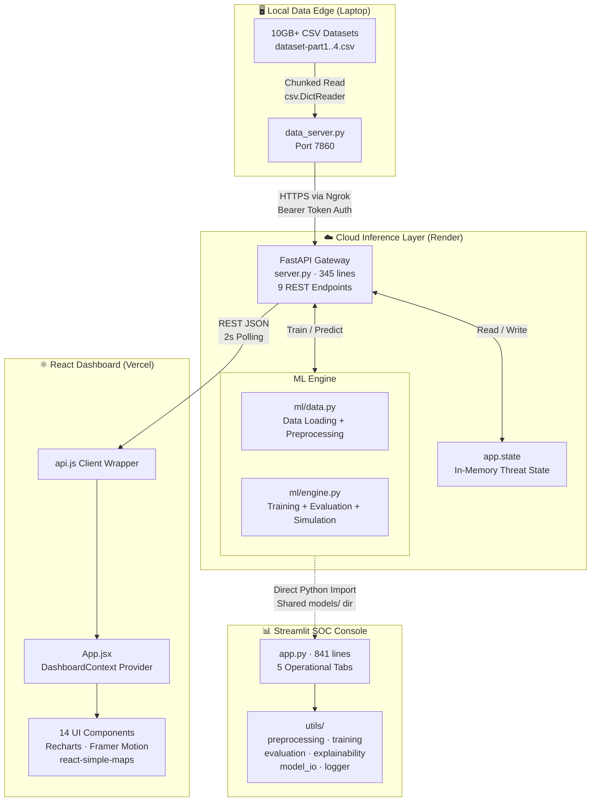

---

## Layer-by-Layer Breakdown

### Layer 0 — Data Edge (Local Laptop)

**File**: `data_server.py` (212 lines)

The Data Edge is a **lightweight HTTP server** that runs on the developer's local machine, serving large CSV datasets to the cloud-hosted backend through an Ngrok tunnel.

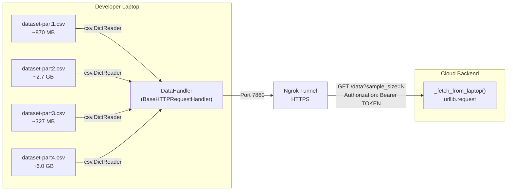

**Architectural Details:**

| Component | Detail |
| :--- | :--- |
| **Server Type** | `http.server.BaseHTTPRequestHandler` (stdlib, zero dependencies) |
| **Endpoints** | `GET /health` (public), `GET /data` (auth required), `GET /info` (auth required) |
| **Auth** | Bearer token validation via `Authorization` header against `DATA_SECRET` env var |
| **Data Strategy** | Interleaved sampling: reads `sample_size / num_files` rows from each CSV, combines via `itertools.chain` |
| **Column Filter** | Only 15 selected TCP/IP features + LABEL are extracted (not full CSV) |
| **Memory Safety** | Streaming via `csv.DictReader` avoids loading entire 10GB+ datasets into RAM |

---

### Layer 1 — Data Ingestion & Preprocessing

**File**: `cyber-dashboard/backend/ml/data.py` (200 lines)

The data layer implements a **3-tier priority loading system** with global caching to prevent redundant downloads during multi-model training.

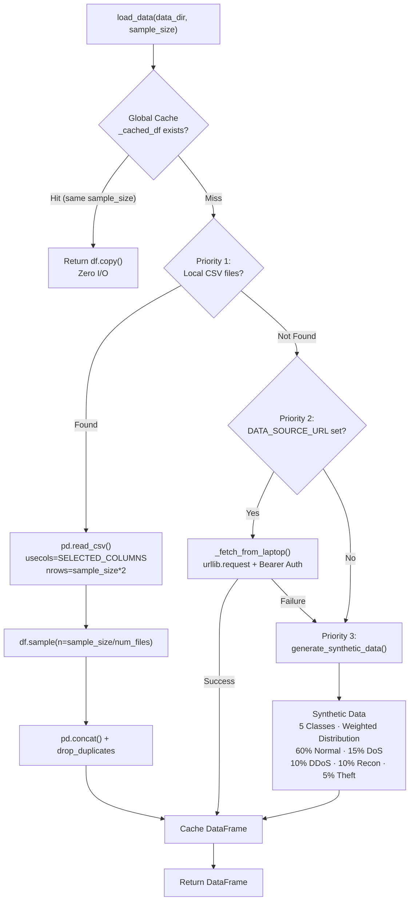

**Preprocessing Pipeline** (`preprocess_data()`):

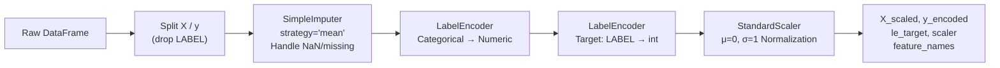

**Feature Vector Architecture:**

The system uses **15 carefully selected TCP/IP features** that span four categories:

| Category | Features | Rationale |
| :--- | :--- | :--- |
| **TCP Window** | `TCP_WIN_SCALE_OUT`, `TCP_WIN_SCALE_IN`, `TCP_WIN_MAX_OUT`, `TCP_WIN_MIN_OUT`, `TCP_WIN_MIN_IN`, `TCP_WIN_MAX_IN`, `TCP_WIN_MSS_IN` | Window scaling anomalies indicate SYN flood, buffer overflow, and resource exhaustion attacks |
| **Protocol Metadata** | `PROTOCOL`, `TCP_FLAGS`, `DST_TOS`, `SRC_TOS` | Protocol violations and abnormal flag combinations (e.g., SYN+FIN) reveal scanning and spoofing |
| **Timing** | `FIRST_SWITCHED`, `LAST_SWITCHED`, `FLOW_DURATION_MILLISECONDS` | Short-duration, high-frequency flows indicate DDoS; long-duration low-traffic flows indicate Slowloris |
| **Flow Statistics** | `TOTAL_FLOWS_EXP` | Exported flow count anomalies signal data exfiltration |

**Memory Optimization:**

```
float64 → float32    (50% memory reduction per float column)
int64   → int32      (50% memory reduction per int column)
Global DataFrame Cache prevents re-download during sequential training
```

---

### Layer 2 — ML Engine

**File**: `cyber-dashboard/backend/ml/engine.py` (144 lines)

The ML Engine is a **stateless, factory-pattern module** that handles model creation, training, evaluation, and real-time packet simulation.

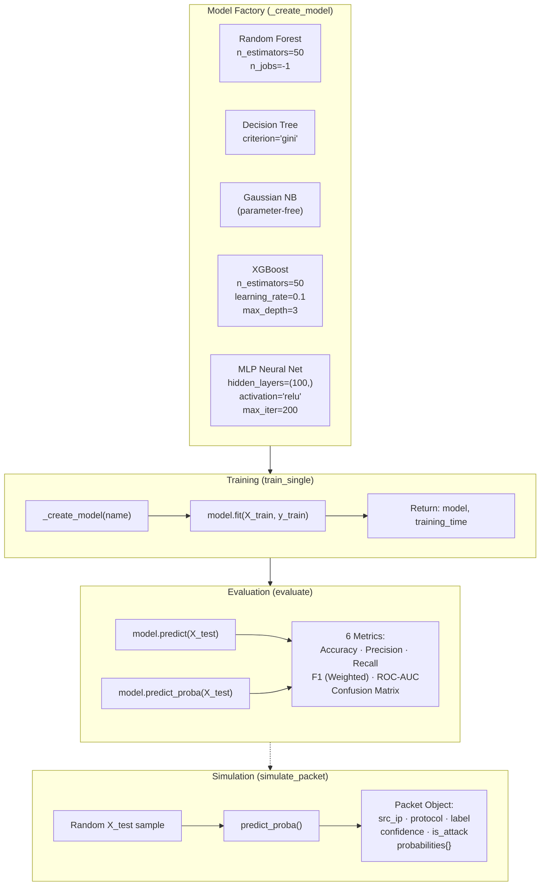

**Model Auto-Selection Algorithm:**

```python
# In server.py — after all models are trained:
best = max(
    app.state.models,
    key=lambda k: app.state.models[k]["metrics"].get("f1", 0)
)
# The model with the highest Weighted F1-Score is auto-promoted
# to handle all live /api/predict traffic
```

The auto-selection uses **Weighted F1-Score** as the ranking metric because:
- **Accuracy** is misleading under class imbalance (60% Normal traffic inflates it)
- **Recall** alone would favor models that flag everything as an attack
- **F1-Score** balances precision and recall; **weighted** variant adjusts for class distribution

---

### Layer 3 — API Gateway (FastAPI)

**File**: `cyber-dashboard/backend/server.py` (345 lines)

The API Gateway is a **FastAPI application** that manages model lifecycle, simulation state, and exposes REST endpoints for both frontends.

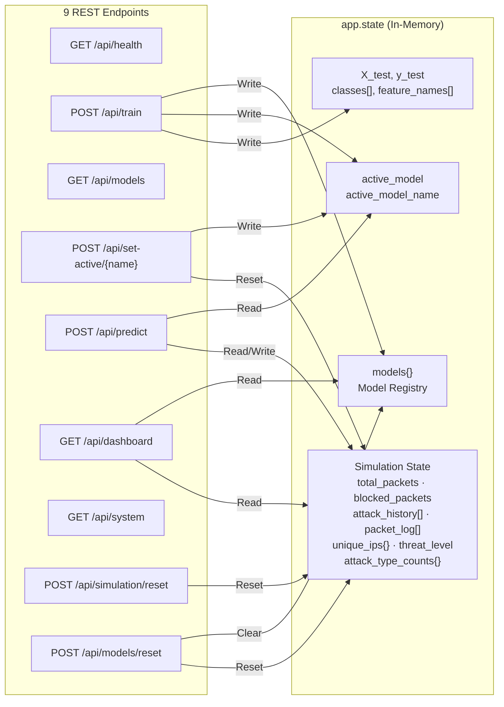

**Endpoint Architecture:**

| Endpoint | Method | Input | Output | Side Effects |
| :--- | :--- | :--- | :--- | :--- |
| `/api/health` | GET | — | `{status, models_loaded}` | None (liveness probe) |
| `/api/train` | POST | `{model_name?, sample_size}` | `{results, classes, active_model, best_model}` | Loads data, trains models, updates registry, resets simulation |
| `/api/models` | GET | — | `{models{}, active_model, classes, feature_names}` | Computes feature importance on-the-fly |
| `/api/set-active/{name}` | POST | Path param | `{active_model}` | Switches active model, resets simulation |
| `/api/predict` | POST | `{count}` | `{packets[], stats{}, log[]}` | Updates all simulation counters |
| `/api/dashboard` | GET | — | Full aggregated state | None (read-only aggregation) |
| `/api/system` | GET | — | `{ram_%, cpu_%, ram_used, ram_total}` | Calls `psutil` (0.1s CPU sampling) |
| `/api/simulation/reset` | POST | — | `{status: "reset"}` | Zeros all simulation counters |
| `/api/models/reset` | POST | — | `{status: "reset"}` | Clears model registry + simulation |

**Middleware:**

```python
CORSMiddleware(allow_origins=["*"])  # Development — restrict in production
```

**Thread Safety:**

```python
# Set at the TOP of server.py, BEFORE any sklearn import
os.environ['OMP_NUM_THREADS'] = '1'
os.environ['OPENBLAS_NUM_THREADS'] = '1'
os.environ['MKL_NUM_THREADS'] = '1'
os.environ['NUMEXPR_NUM_THREADS'] = '1'
```

This prevents the BLAS/OpenMP multi-threading layer from creating parallel threads inside scikit-learn, which causes deadlocks on Windows when combined with FastAPI's async event loop.

---

### Layer 4A — React Dashboard (Vite)

**Directory**: `cyber-dashboard/src/` (14 components)

The React frontend is a **Single Page Application (SPA)** built with Vite, using React Context API for global state and a 2-second polling loop for real-time data.

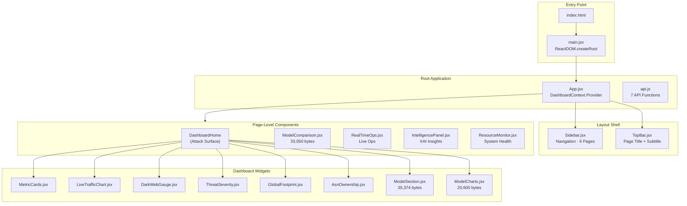

**Client-Side State Flow:**

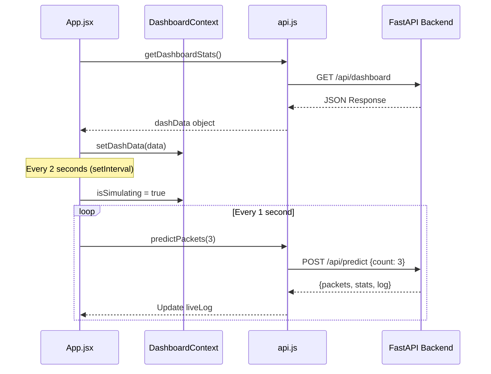

**Page Routing Architecture:**

| Page Key | Component | Description |
| :--- | :--- | :--- |
| `dashboard` / `attack-surface` | `DashboardHome` | 8 widget grid: metrics, live chart, gauge, severity rings, model section, charts, geo-map, ASN |
| `model-comparison` | `ModelComparison` | Side-by-side benchmark of all trained models with bar charts and metrics tables |
| `real-time-ops` | `RealTimeOps` | Live packet stream, start/stop/reset simulation controls, threat level |
| `intelligence` | `IntelligencePanel` | XAI feature importance, model behavior analysis, per-packet explanations |
| `resources` | `ResourceMonitor` | Live RAM/CPU gauges via `/api/system` |

---

### Layer 4B — Streamlit SOC Console

**Directory**: `IntrusionDetectionDashboard/` (841-line `app.py` + 6 utility modules)

The Streamlit dashboard is a **standalone Python application** designed for Security Analysts and Data Scientists. Unlike the React dashboard, it **directly imports** the ML libraries and can perform training, evaluation, and SHAP explainability in the same process.

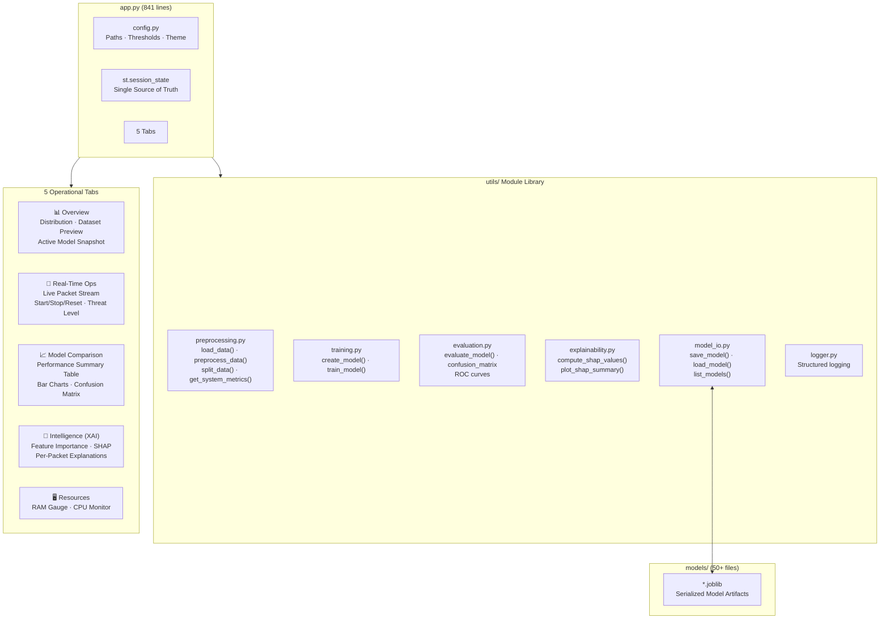

**Streamlit Session State Architecture:**

```python
# Single Source of Truth — initialized once via init_state()
st.session_state = {
    'model': None,                    # Active sklearn model object
    'model_registry': {},             # {name: {model, accuracy, f1, ...}}
    'active_model_name': 'None',      # String identifier
    'classes': [],                    # LabelEncoder classes
    'feature_names': [],              # Column names for XAI
    'test_data': (None, None),        # (X_test, y_test) tuple
    'simulation_running': False,      # Simulation toggle
    'total_packets': 0,               # Packet counter
    'blocked_packets': 0,             # Attack counter
    'packet_log': [],                 # Recent packet history
    'attack_history': [],             # Rolling window for threat level
    'threat_level': 'LOW',            # Computed threat level
}
```

---

## Data Flow Architecture

The complete data flow from raw CSV to rendered UI pixel:

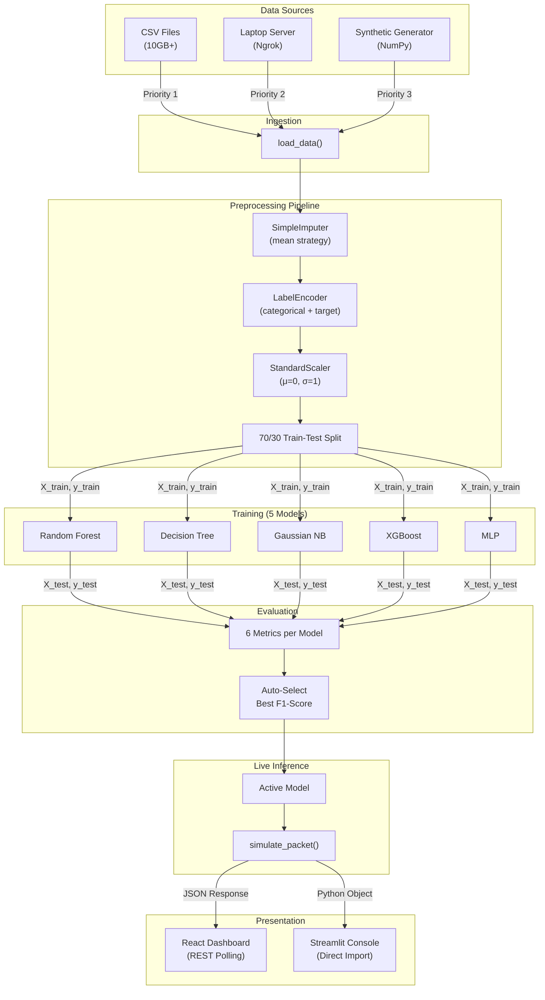

---

## State Management Architecture

The system uses **two distinct state management patterns** for its two frontends:

### FastAPI Backend State (`app.state`)

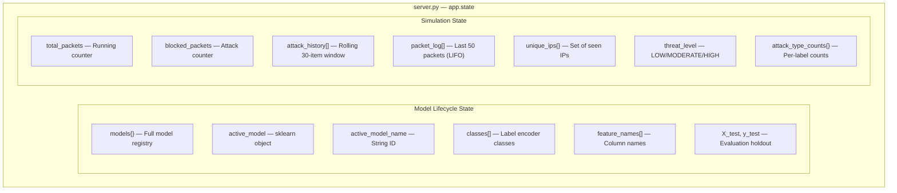

> **Key Design Decision:** All state is held in-memory via `app.state`. This is intentionally volatile — a server restart wipes all simulation data. This is acceptable because:
> - Training can be re-triggered via `/api/train`
> - The system is a real-time simulation, not a persistent audit log
> - In-memory state provides sub-millisecond read/write latency

### React Frontend State

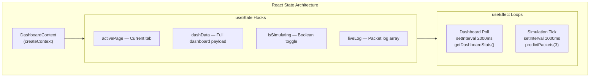

### Streamlit Session State

The Streamlit frontend uses `st.session_state` as a **global mutable dictionary**, with `@st.cache_data` decorators on `load_data()` and `preprocess_data()` for memoization. Model objects are stored directly in session state, enabling in-process `.predict()` calls without HTTP overhead.

---

## ML Training Pipeline Architecture

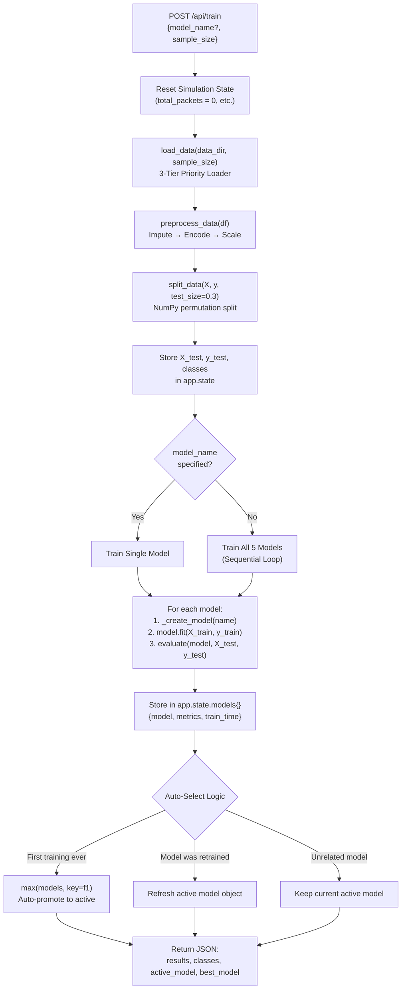

**Training Time Complexity:**

| Model | Training Complexity | Typical Time (100k samples) |
| :--- | :--- | :--- |
| Random Forest | O(n · m · T · log n) where T=50 trees | ~2-5s |
| Decision Tree | O(n · m · log n) | <1s |
| Gaussian NB | O(n · m) linear scan | <0.5s |
| XGBoost | O(n · m · T · d) where T=50, d=3 | ~3-8s |
| MLP | O(n · m · h · iter) where h=100, iter=200 | ~5-15s |

---

## Real-Time Inference Architecture

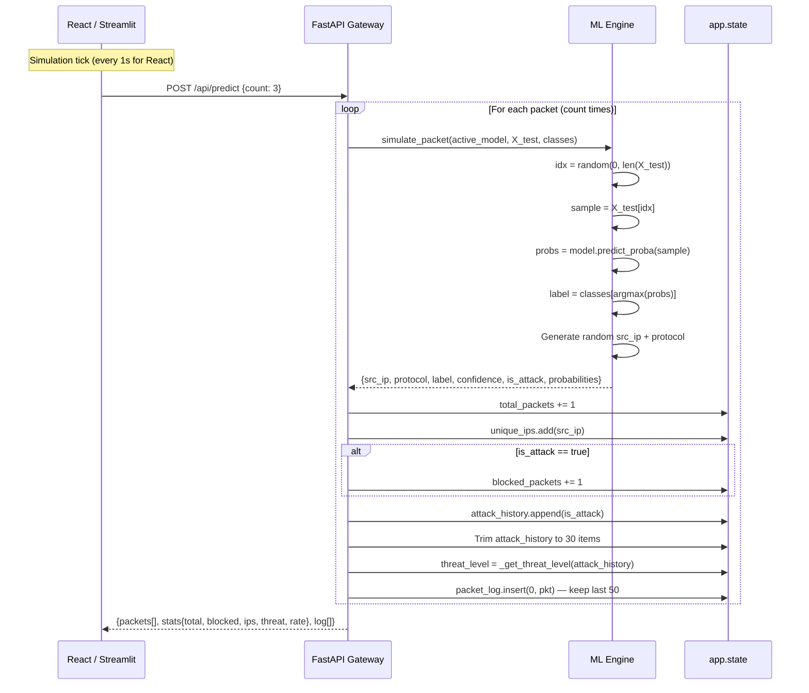

**Threat Level Algorithm:**

```python
def _get_threat_level(history):
    rate = sum(history) / len(history)  # attack_ratio over last 30 packets
    if rate > 0.20:  return "HIGH"      # >20% attacks = critical
    if rate > 0.05:  return "MODERATE"  # 5-20% attacks = elevated
    return "LOW"                         # <5% attacks = nominal
```

---

## Explainable AI (XAI) Architecture

The XAI system operates at **two levels of granularity**:

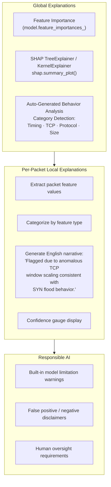

**SHAP Explainer Selection:**

| Model Type | Explainer | Why |
| :--- | :--- | :--- |
| Random Forest, Decision Tree, XGBoost | `shap.TreeExplainer` | Exact SHAP values in polynomial time for tree-based models |
| MLP, Gaussian NB | `shap.KernelExplainer` | Model-agnostic approximation (slower, uses `predict_proba` as black box) |

---

## Component Dependency Graph

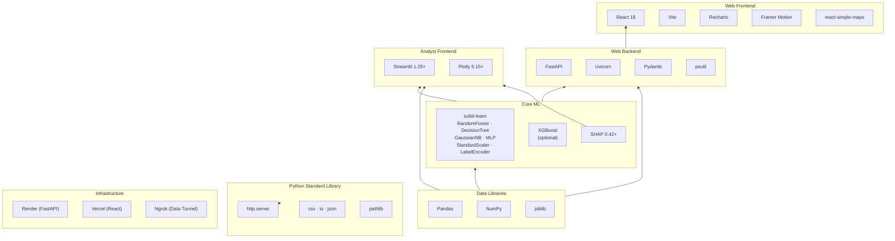

---

## Security Architecture

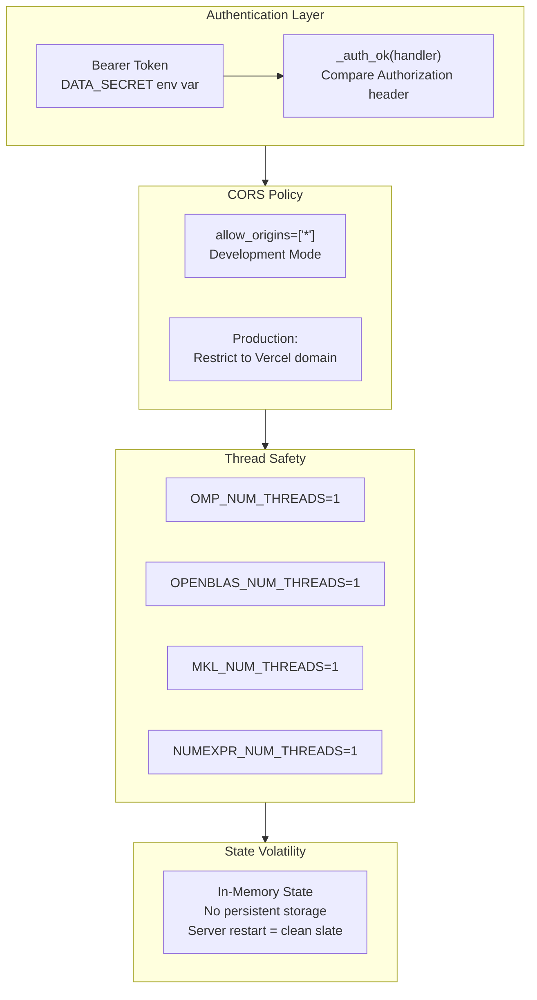

**Attack Surface Minimization:**

1. **Data Server** — Only 3 endpoints exposed; `/data` and `/info` require Bearer token
2. **FastAPI** — No authentication on API endpoints (demo/internal use); CORS wildcard must be restricted in production
3. **State** — Volatile by design; no database, no file writes during inference (only joblib saves during training in Streamlit)
4. **Dependencies** — `xgboost` is optional (`try/except ImportError`); the system gracefully degrades if not installed

---

## Deployment Architecture

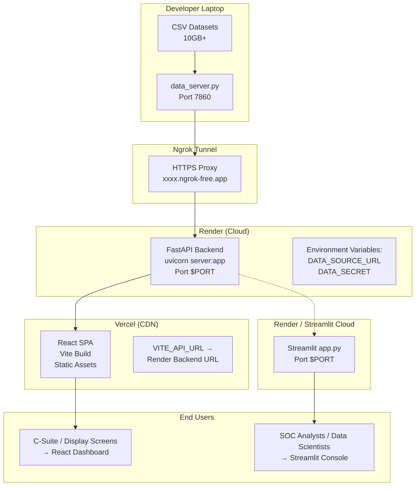

**Deployment Configuration per Service:**

| Service | Platform | Root Directory | Build Command | Start Command |
| :--- | :--- | :--- | :--- | :--- |
| FastAPI Backend | Render | `cyber-dashboard/backend` | `pip install -r requirements.txt` | `uvicorn server:app --host 0.0.0.0 --port $PORT` |
| React Frontend | Vercel | `cyber-dashboard` | `npm install && npm run build` | Static (CDN) |
| Streamlit Console | Render / Streamlit Cloud | `IntrusionDetectionDashboard` | `pip install -r requirements.txt` | `streamlit run app.py --server.port $PORT` |
| Data Server | Local | Repository root | — | `python data_server.py` + `ngrok http 7860` |

---

<div align="center">

**Built by [Soubhagya Jain](https://github.com/SoubhagyaJain)**

*Architecture documentation for CyberSentinel AI v3.0*

</div>
