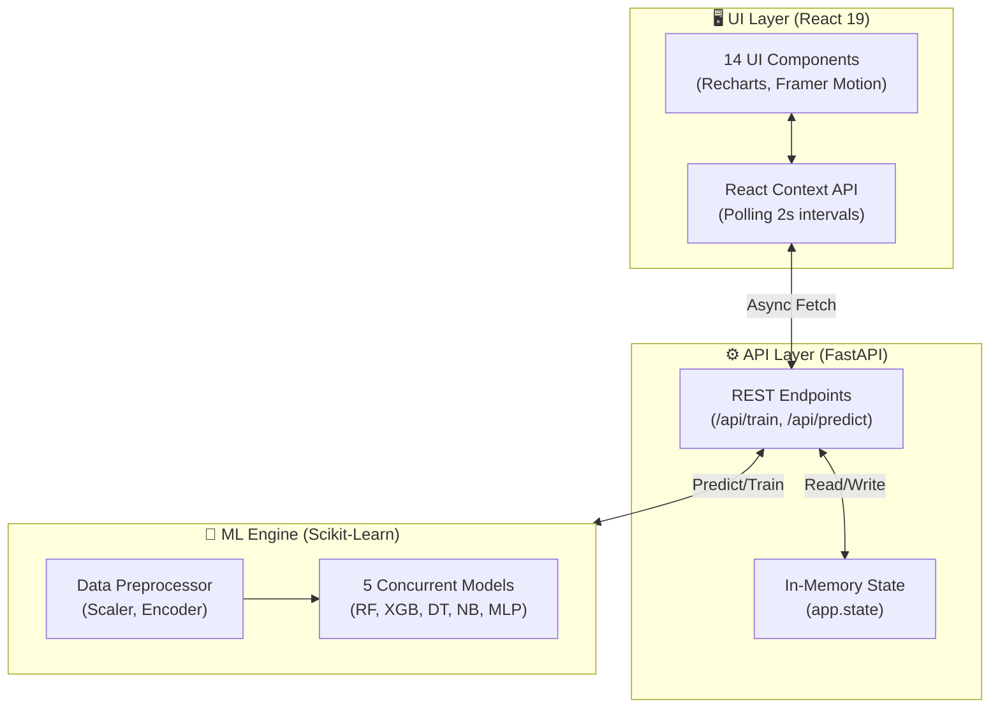

<div align="center">

# 🛡️ CyberSentinel AI Dashboard — Architecture & ML Deep Dive

**A real-time network intrusion detection system powered by 5 concurrently trained ML classifiers, served via a FastAPI backend, and visualized in a React 19 SOC-style dashboard.**

[](https://react.dev)
[](https://vitejs.dev)
[](https://fastapi.tiangolo.com)
[](https://python.org)
[](https://scikit-learn.org)

</div>

---

## 📸 Executive Summary

CyberSentinel is an end-to-end Machine Learning pipeline and real-time inference dashboard designed to detect network anomalies. It tackles a critical challenge in cybersecurity: **alert fatigue caused by black-box algorithms**. 

This system trains **five different ML models simultaneously**, evaluates them on a hold-out test set, and **auto-promotes the best-performing model** to a live inference engine. All predictions are generated in real-time and tracked in a sleek React frontend.

---

## 🧠 Engineering Thought Process (The "Why")

Building a production-ready ML system is more than calling `model.fit()`. Here are the architectural decisions made to ensure performance, reliability, and explainability:

### 1. The FastAPI Gateway
**Why FastAPI over Flask?**
- **Async-First:** Intrusion detection requires handling high-frequency prediction requests concurrently without blocking the event loop. FastAPI's ASGI support makes it optimal for I/O-bound simulation fetching.
- **Data Validation:** Pydantic models automatically validate incoming JSON structures (e.g., packet simulation requests), catching malformed payloads before they reach the ML engine.
- **In-Memory State:** Instead of a complex Redis setup, the application state (models, threat levels, packet logs) lives in `app.state`. This provides **sub-millisecond latency** for read/write operations during real-time inference, which is crucial for a simulation dashboard.

### 2. The 3-Tier Data Ingestion Priority
Relying on massive (10GB+) static CSVs makes deployments fragile. The data loader implements a highly resilient 3-tier fallback strategy, caching results globally to prevent redundant I/O during multi-model training:
- **Priority 1:** Read chunked samples directly from local split CSVs via `csv.DictReader` (Memory-safe streaming).
- **Priority 2:** Fetch samples via an authenticated remote HTTP laptop server over an Ngrok tunnel (Edge-to-Cloud).
- **Priority 3:** Fallback to a configurable NumPy synthetic data generator based on realistic network threat class distributions (60% Normal, 10% DDoS, etc.). **The system will never crash due to a missing file.**

### 3. Thread Safety & Concurrency Traps
**The Scikit-Learn Windows Deadlock:** `scikit-learn` uses OpenMP and BLAS internally for parallel operations. When mixed with an asynchronous FastAPI event loop, this causes silent thread deadlocks on Windows or Docker environments. 
- **The Fix:** The environment variables `OMP_NUM_THREADS=1`, `OPENBLAS_NUM_THREADS=1`, and `MKL_NUM_THREADS=1` are strictly enforced *before* any ML libraries are imported. We explicitly handle concurrency at the worker layer (`--workers 1` with a dedicated `app.state`), trading internal ML multi-threading for stable, predictable API concurrency.

---

## 📈 Metric Optimization Pipeline (The "What")

How did we increase accuracy and ensure the models were actually learning, rather than overfitting?

### 1. Feature Engineering (Signal over Noise)
Throwing an 80-column CSV at a Random Forest leads to high dimensionality and massive latency. We systematically narrowed the input vector to **15 core TCP/IP features** grouped by behavior:
- **TCP Window Scaling** (`TCP_WIN_SCALE_OUT`, etc.): Crucial for identifying SYN floods and buffer overflow attempts.
- **Protocol Metadata** (`TCP_FLAGS`, `PROTOCOL`): Flags mismatched combinations frequently used in port scanning (e.g., FIN+SYN).
- **Timing** (`FLOW_DURATION_MILLISECONDS`): Short bursts detect DDoS; long, trickling flows unmask Slowloris attacks.

### 2. Preprocessing & Memory Optimization
A standard pipeline ensures all models receive standardized distributions:
- **Data Types:** Downcasting `float64` columns to `float32` and `int64` to `int32` **cut RAM usage by 50%**.
- **Imputation:** `SimpleImputer(strategy='mean')` prevents crashes from corrupted network logs.
- **Scaling:** `StandardScaler` ($\mu=0, \sigma=1$) normalizes disparate scales (a 1ms duration vs. a 65,535 window size) so models like MLPs and Gaussian Naive Bayes can converge efficiently.

### 3. Model Auto-Promotion Logic
Accuracy is a dangerous metric in cybersecurity. If a dataset is 99% normal traffic, a model that simply predicts "Normal" every time is 99% accurate but completely useless.

**The Solution:** Models are ranked and auto-promoted based on their **Weighted F1-Score**.
- **Recall** measures how many actual attacks were caught.
- **Precision** measures if the alerts are actually true (reducing alert fatigue).
- **F1-Score** is the harmonic mean of both. The *weighted* variant adjusts for the inherent class imbalance (e.g., millions of Normal packets vs. a few hundred SQLi attempts). 

---

## 🏗️ System Architecture

The architecture decouples the visualization layer from the computationally heavy inference layer:



---

## 🚀 Developer Guide & Quick Start

### Prerequisites
- Python 3.9+ 
- Node.js 18+

### 1. Spin up the API Backend
Open your terminal (PowerShell for Windows) and navigate to the backend directory:
```bash
cd "cyber-dashboard/backend"
python -m venv venv

# Windows Virtual Env Activation
.\venv\Scripts\activate

# Install critical ML packages pinned for stability first
pip install numpy==1.26.4 scipy==1.11.4 scikit-learn==1.3.2
pip install pandas fastapi "uvicorn[standard]" psutil joblib xgboost

# Start the server (Must be 1 worker for app.state sharing)
uvicorn server:app --port 8000 --workers 1
```

### 2. Spin up the React Dashboard
Open a second terminal and trigger the Vite dev server:
```bash
cd "cyber-dashboard"
npm install
npm run dev
```

### 3. Usage Flow
1. Open up `http://localhost:5173`.
2. Navigate to the **Model Comparison** tab and hit **⚡ Train All Models**. The backend will ingest data, train all 5 models, and auto-select the best one based on F1 metrics.
3. Switch to **Real-Time Ops** and hit **▶ Start Simulation** to pipe virtual network traffic into the active model and view the live threat assessment.

---

## ⚠️ Critical Troubleshooting

- **Models disappearing after saving a Python file:** Do **not** use `uvicorn --reload` in development. It wipes the `app.state` memory space containing the loaded models on every save.
- **Port Conflicts & "Failed to Fetch":** The React frontend expects the API at `localhost:8000`. Ensure neither `React` nor `Uvicorn` deviate from their explicit ports.
- **Deadlocks during training:** Ensure `os.environ['OMP_NUM_THREADS'] = '1'` remains at the *very top* of `server.py` before any other imports.

---

<div align="center">

**Built for high-stakes telemetry monitoring.**  
_Securing the zero-trust network layer, one packet at a time._

</div>
